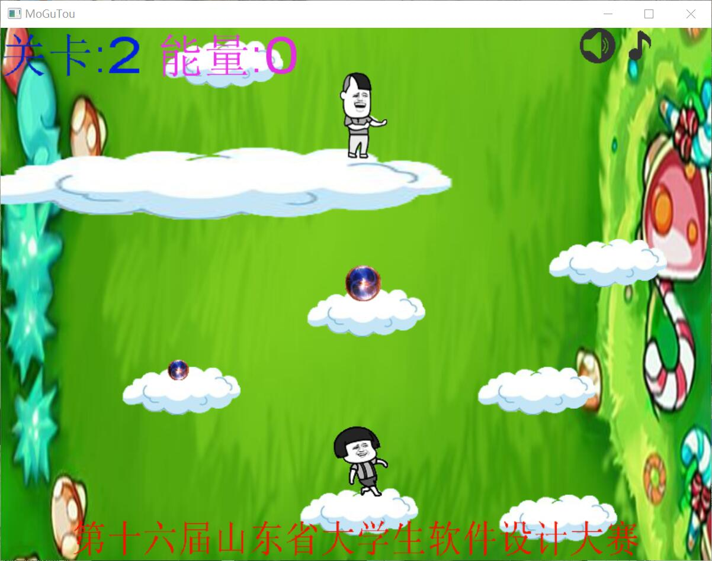

# CASCADE
## 基于FunCode平台的游戏开发（C）
此代码为启蒙阶段学习使用的，代码不是非常严谨，可能存在一些问题，并未使用面向对象的思想，只是简单的逻辑关系调用，仅供使用FunCode作为引擎开发的同学作参考。
**所有图片资源均来自网络**
**游戏运行需要FunCode的支持**
## 游戏截图

## 视频演示
##### 地址
**https://pan.baidu.com/s/1udnvq68d3_O0s4NTE-wNLw**
##### 提取码
**20d9**
## 操作说明
### 游戏操作说明：
#### 主角移动：
（1）w：跳跃（可连续跳两次）或上移
（2）d：前进
（3）a：后退
（4）s：下移
#### 主角攻击：
（1）J：疾跑
（2）k：近身攻击
（3）L：释放火球
#### 音乐控制：
（1）O:开启/关闭攻击音效
（2）P:开启/关闭背景音乐
#### 控制键
ESC：退出游戏/回到主菜单

### 关卡说明
共三关，可选择关卡。
##### 第一关
横向地图，草地主题，草地、小怪、能量球和红旗精灵。
##### 第二关
纵向地图，天空主题，云朵、小怪、能量球和红旗精灵。
##### 第三关
平铺地图，海洋主题，Boss召唤鱼兵，鱼兵规律出现。

### 通关条件说明
##### 第一关
跨越沟壑，击杀小怪，收集能量，到达红旗处即为过关。
##### 第二关
向上跳跃，击杀小怪，收集能量，到达红旗处即为过关。
##### 第三关
消耗能量，释放技能，躲避/击杀小鱼兵，击杀Boss过关。

